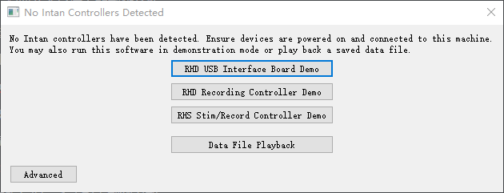
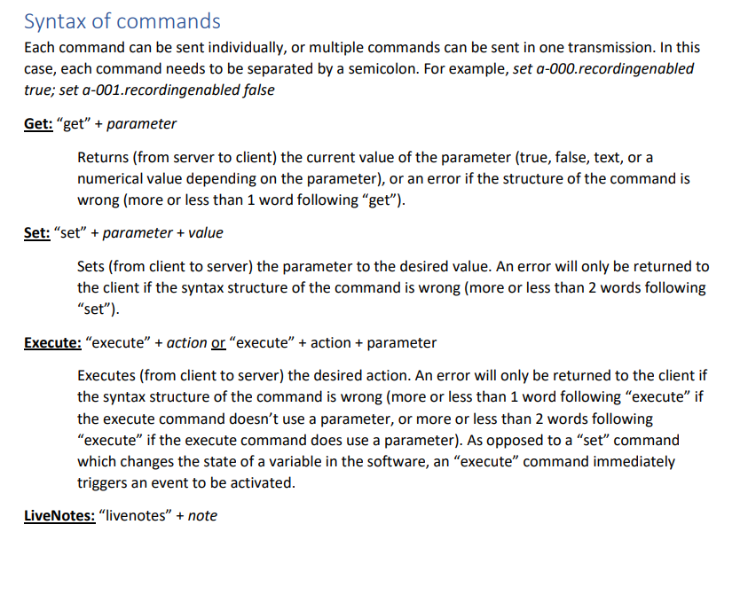
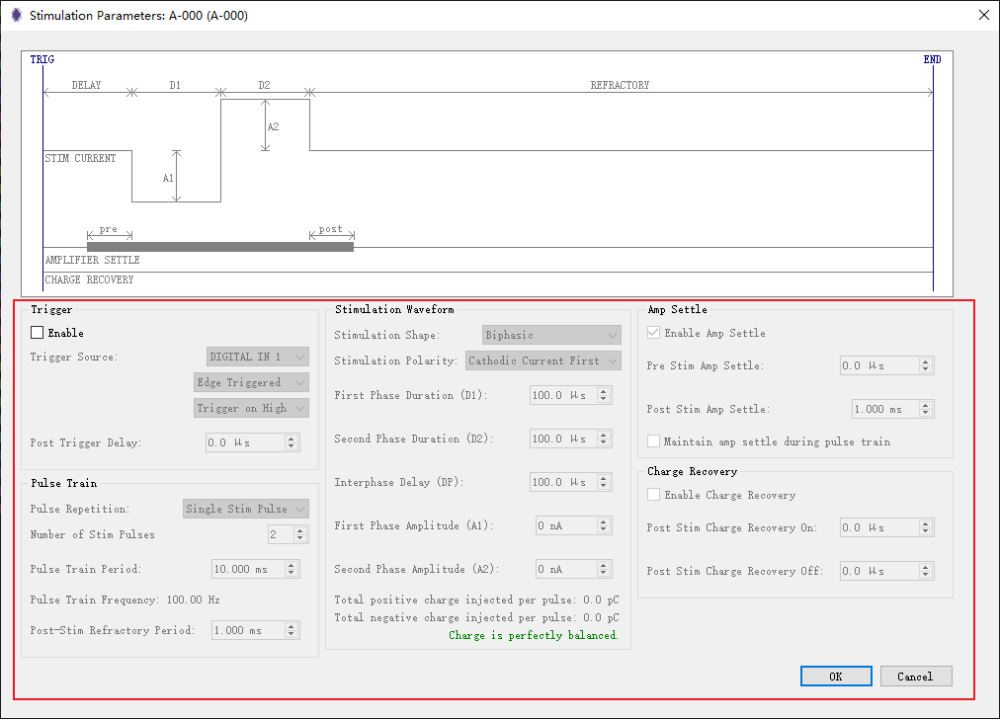
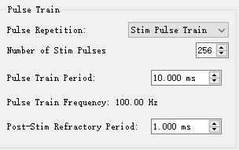
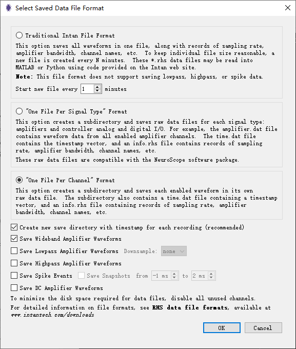

### RHXRunAndStimulate 刺激接口文档

该脚本演示了如何通过TCP连接到RHX软件并控制刺激/记录控制器。**它在指定通道上设置刺激参数，并实施刺激，记录 2s 数据。**

在运行此脚本之前，请确保IntanRHX软件已启动，并使用刺激/记录控制器或合成的刺激/记录控制器（Intan 模拟模式有四种模式可选择，选带刺激的即可，实机连接时不存在该问题）。其他控制器类型无法与此脚本配合使用。



通过 IntanRHX 软件中的网络 -> 远程TCP控制，命令输出应该打开一个连接到 127.0.0.1，端口 5000 的连接，并且状态应该显示为“Pending”。即可发起连接。

### 2 指令构建原则

简言之，指令就分三种类型，Get 获取状态，Set 设置参数，Execute 执行某些指令动作。

> 具体要做哪些操作时，再进行交接，调研操作指令。



**涉及到具体实验操作的接口设计时，设置一个参数传递套接字对象，指令构建基本思路就是按序构建字符串指令，顺序就是实验操作顺序（如果是一次发送多个指令，使用；分割），最终将构建的长字符串发送给Intan执行即可.**

### 3 刺激施加原则

任何刺激的施加都一定基于**两个步骤**，第一是刺激参数的**设置并上传**，第二个是基于参数设置的**触发器**进行刺激触发。

##### 3.1 可设置刺激参数

图示中包含的刺激参数均可设置，当然还包含其他可设置的参数。

注意以该图示为准，因为指令的参数也是以该图为准的，就是说这张图中的参数改不了的，指令也基本改不了。




##### 3.2 刺激参数设置指令

就可设置的基本罗列，之后有新需求后再进一步调研。

> 目前就是长序列刺激，单点刺激的参数作了完整调研。

`注意：`

1. 就上述提到的刺激施加原则，下列所有刺激参数，都是在一次设置后生效的，设置后由触发器触发刺激。
2. Intan 在 Run / Record 模式下是不能够修改刺激参数的，一定要停止记录或者停止运行后才能修改。

``` python
Stimulation Parameters
The following parameters are accessed for each channel in the same manner as the other Channel
Manipulation parameters. However, these are all exclusively valid with the Stimulation/Recording
Controller, and they dictate the parameters of triggered stimulation for Amplifier Channels, Analog
Output Channels, and Digital Output Channels. Setting these parameters updates their values in the
IntanRHX software, but in order for the changes to take effect when the board begins running again, the
parameters must be uploaded to the controller by Executing the command UploadStimParameters.
Amplifier Channel Stimulation Parameters

# Shape
• Which shape the stimulation waveform will have
• Acceptable values:
o “Biphasic” – A positive/negative current at a given magnitude immediately followed by a
current with the opposite polarity (Default)
IntanRHX 3.3.1
50
o “BiphasicWithInterphaseDelay” – A positive/negative current at a given magnitude
followed by a current with the opposite polarity, with a delay of zero current between
the two
o “Triphasic” – A positive/negative current at given magnitude immediately followed by a
current with the opposite polarity, which is immediately followed by a current with the
first current’s polarity, magnitude, and duration
# Polarity
• Whether the stimulation waveform will begin with negative (cathodic) or positive (anodic)
current
• Acceptable values:
o “NegativeFirst” – The first phase of the stimulation waveform will inject negative charge
o “PositiveFirst” – The first phase of the stimulation waveform will inject positive charge
# Source
• Which Digital Input, Analog Input, or Keypress event will trigger this stimulation waveform
• Acceptable values:
o “DigitalInXX” where XX is a 2-digit number from 01 to 16 (Default: DigitalIn01)
o “AnalogInXX” where XX is a 2-digit number from 01 to 08
o “KeyPressFX” where X is a 1-digit number from 1 to 8, corresponding to the F1-F8 keys
on the keyboard
# TriggerEdgeOrLevel
• Whether the event that triggers stimulation will be activated once on a rising/falling edge or
continuously stay active above or below a certain level
• Acceptable values:
o “Edge” – A trigger event will occur once when the value on the trigger source changes
from inactive to active (Default)
o “Level” – Trigger events will occur continuously when the value on the trigger source is
active until the value becomes an inactive value
# TriggerHighOrLow
• Whether the event that triggers stimulation will be activated when a high or low value is
detected
• Acceptable values:
o “High” – A trigger event will occur when the trigger source detects a high value (Default)
o “Low” – A trigger event will occur when the trigger source detects a low value
# PulseOrTrain - 长序列刺激相关
• Whether the stimulation waveform will occur once as a single pulse, or if it will be repeated
multiple times as a pulse train
• Acceptable values:
o “SinglePulse” – A single trigger event will result in a single pulse of the stimulation
waveform (Default)
o “PulseTrain” – A single trigger event will result in multiple pulses of the stimulation
waveform (the number of pulses is controlled through NumberOfStimPulses)
IntanRHX 3.3.1
51
# StimEnabled
• Whether or not stimulation is enabled on this channel
• Acceptable values:
o “True” – A trigger event will result in stimulation activation
o “False” – A trigger event will not result in stimulation activation (Default)
# MaintainAmpSettle
• Whether or not amp settle (if EnableAmpSettle is True) will be maintained during the entirety of
the pulse train period, including the time between consecutive stimulation pulses
• Acceptable values:
o “True” – Amp settle will remain active throughout the entirety of the pulse train
o “False” – Amp settle will only activate during, immediately before, and immediately
after each individual stimulation pulse (Default)
# EnableAmpSettle
• Whether or not amp settle will activate during, immediately before, and immediately after
stimulation
• The time period before and after stimulation for which amp settle shall activate are controlled
through PreStimAmpSettleMicroseconds and PostStimAmpSettleMicroseconds
• Acceptable values:
o “True” – Amp settle will activate when stimulation occurs (Default)
o “False” – Amp settle will not activate when stimulation occurs
# EnableChargeRecovery
• Whether or not charge recovery will activate after stimulation has finished
• The time period after stimulation and for how long charge recovery shall activate are controlled
through PostStimChargeRecovOnMicroseconds and PostStimChargeRecovOffMicroseconds
• Acceptable values:
o “True” – Charge recovery will activate when stimulation has finished
o “False” – Charge recovery will not activate when stimulation has finished (Default)
# FirstPhaseDurationMicroseconds
• How many microseconds the first phase of stimulation will last for
• Acceptable values:
o Decimal value within the range “0” to “5000”, in µs (Default: 100)
# SecondPhaseDurationMicroseconds
• How many microseconds the second phase of stimulation will last for
• Acceptable values:
o Decimal value within the range “0” to “5000”, in µs (Default: 100)
# InterphaseDelayMicroseconds
• How many microseconds between the first and second phases of stimulation zero current will
be output for, if Shape is BiphasicWithInterphaseDelay
• Acceptable values:
o Decimal value within the range “0” to “5000”, in µs (Default: 100)
IntanRHX 3.3.1
52
# FirstPhaseAmplitudeMicroAmps
• The amplitude of the first phase of stimulation, in microAmps
• This value is limited to integer multiples (between 1 and 255) of stimulation step size
• Acceptable values:
o Decimal value within the range “0” to “2550”, in µA (Default: 0)
# SecondPhaseAmplitudeMicroAmps
• The amplitude of the second phase of stimulation, in microAmps
• This value is limited to integer multiples (between 1 and 255) of stimulation step size
• Acceptable values:
o Decimal value within the range “0” to “2550”, in µA (Default: 0)
# PostTriggerDelayMicroseconds
• How many microseconds between the stimulation trigger and the beginning of the stimulation
waveform
• Acceptable values:
o Decimal value within the range “0” to “500000”, in µs (Default: 0)
# PulseTrainPeriodMicroseconds     - 长序列刺激相关
• How many microseconds each single stimulation pulse lasts before the next stimulation pulse in
the pulse train begins
• Acceptable values:
o Decimal value within the range “0” to “1000000”, in µs (Default: 10000)
# RefractoryPeriodMicroseconds     - 长序列刺激相关
• How many microseconds after a complete stimulation event (either SinglePulse or PulseTrain)
pass with no further stimulation before the next stimulation event can trigger
• Acceptable values:
o Decimal value within the range “0” to “1000000”, in µs (Default: 1000)
# PreStimAmpSettleMicroseconds
• How many microseconds before a stimulation waveform triggers for which amp settle is
activated, if EnableAmpSettle is True
• Acceptable values:
o Decimal value within the range “0” to “500000”, in µs (Default: 0)
# PostStimAmpSettleMicroseconds
• How many microseconds after a stimulation waveform ends for which amp settle is activated, if
EnableAmpSettle is True
• Acceptable values:
o Decimal value within the range “0” to “500000”, in µs (Default: 1000)
# PostStimChargeRecovOnMicroseconds
• How many microseconds after a stimulation waveform ends until charge recovery begins, if
EnableChargeRecovery is True
• The total length of time that charge recovery is active is PostStimChargeRecovOffMicroseconds -
# PostStimChargeRecovOnMicroseconds
IntanRHX 3.3.1
53
• Acceptable values:
o Decimal value within the range “0” to “1000000”, in µs (Default: 0)
# PostStimChargeRecovOffMicroseconds
• How many microseconds after a stimulation waveform ends until charge recovery ends, if
EnableChargeRecovery is True
• The total length of time that charge recovery is active PostStimChargeRecovOffMicroseconds –
# PostStimChargeRecovOnMicroseconds
• Acceptable values:
o Decimal value within the range “0” to “1000000”, in µs (Default: 0)
# NumberOfStimPulses       - 长序列刺激相关
• How many stimulation pulses will occur for a single stimulation trigger, if PulseOrTrain is PulseTrain
• For a single stimulation pulse, PulseOrTrain should be SinglePulse
• Acceptable values:
o Integer value within the range “0” to “256” (Default: 2)
```

**Eg：**

``` python
# 单点刺激设置
def configureStimulation(scommand, channel, source, amplitude, duration, stimenabled=True):
    command = f'set {channel}.stimenabled {stimenabled}'
    scommand.sendall(command.encode())
    time.sleep(0.1)

    command = f'set {channel}.source {source}'
    scommand.sendall(command.encode())
    time.sleep(0.1)

    command = f'set {channel}.firstphaseamplitudemicroamps {amplitude}'
    scommand.sendall(command.encode())
    time.sleep(0.1)

    command = f'set {channel}.firstphasedurationmicroseconds {duration}'
    scommand.sendall(command.encode())
    time.sleep(0.1)
   	
    # --- 上述提到的刺激参数均可再此处一并设置完成---
    
    # --- 关于长序列刺激设置的指令，PulseOrTrain 设置为 PulseTrain ，并设置 Train 中各项参数即可---
    
    command = f'set {channel}.PulseOrTrain PulseTrain'
    scommand.sendall(command.encode())
    time.sleep(1)
    
    # NumberOfStimPulses 0-256
    command = f'set {channel}.NumberOfStimPulses 256'
    scommand.sendall(command.encode())
    time.sleep(1)
    
    # --- 关于长序列刺激设置的指令，PulseOrTrain 设置为 PulseTrain ，并设置Train 中各项参数即可---
	
    # 该步必须上传，否则无法使设置生效。
    command = f'execute uploadstimparameters {channel}'
    scommand.sendall(command.encode())
    time.sleep(1)

    
 # 触发器触发刺激，运行或者记录时才能触发，仅作说明，可作为长指令一并发送。
 def triggerStimulation(scommand, key):
    scommand.sendall(b'set runmode record')
    time.sleep(0.1)
    
    # 触发指令
    command = f'execute manualstimtriggerpulse {key}'
    scommand.sendall(command.encode())
    time.sleep(0.1)
    
    scommand.sendall(b'set runmode stop')
    time.sleep(0.1)

```


### 4 Intan Server TCP指令解析原则 

Intan Server 基于**字符串**构建的指令进行解析。

- 连续指令的发送可以通过构建一个长字符串，由各个指令拼接而成，指令字符串之间使用 ‘；’间隔，将长字符串直接发送即可。

- 单条指令发送后一定要暂缓 0.1s，后发送第二条

  > 不暂缓发送，容易导致指令无法解析，如果想要一次发多个指令，那么就将所有指令字符串后均添加；，防止指令混淆处理.

**Eg：**

``` python
    # -------------------- 该指令基本涵盖了刺激参数设置并保证可被触发器触发的基本方法，即设置完后直接触发即可施加刺激 -----------------
    command = f'set {channel}.stimenabled {stimenabled}'
    scommand.sendall(command.encode())
    time.sleep(0.1)

    command = f'set {channel}.source {source}'
    scommand.sendall(command.encode())
    time.sleep(0.1)

    command = f'set {channel}.firstphaseamplitudemicroamps {amplitude}'
    scommand.sendall(command.encode())
    time.sleep(0.1)

    command = f'set {channel}.firstphasedurationmicroseconds {duration}'
    scommand.sendall(command.encode())
    time.sleep(0.1)

    command = f'execute uploadstimparameters {channel}'
    scommand.sendall(command.encode())
    time.sleep(1)
    
    # -------------------- 单指令发送存在时延 -----------------
    
    command1 = f'set {channel}.stimenabled {stimenabled};'

    command2 = f'set {channel}.source {source};'

    command3 = f'set {channel}.firstphaseamplitudemicroamps {amplitude};'

    command4 = f'set {channel}.firstphasedurationmicroseconds {duration};'

    command5 = f'execute uploadstimparameters {channel};'

    command = command1 + command2 + command3 + command4 + command5;
    scommand.sendall(command.encode())
    time.sleep(1)
    
    #---------------------- 字符串使用 ; 拼接后一并发送即可，不能缺少; -----------------
```


### 5 已封装功能接口 API：

> 提供完成某些操作的基本指令，简单封装接口，有其他需求时，基于指令重新封装即可，封装方式见 2.
>
> 目前封装的接口尽量保证了完整，所以把涉及的操作全都囊括进来了，有进一步的开发需求，可以将将部分内容移出到主调函数中.

`注意：`

1. 原则还是 Intan 软件人工能够操作的范围，也是 Intan  TCP 能够操作的范围.
2. 此处将一些基本功能的指令做了简单封装.

##### 1 单点刺激 设置与触发.

  ``` python
  def configureSingleStimulation(scommand, channel, source, amplitude, duration, stimenabled = False):
  
      """
      生成配置单个通道刺激设置的命令字符串。
  
      :param scommand: 已连接到TCP服务器的套接字对象。此函数生成命令字符串，但不发送它；
                       调用者负责使用此套接字发送命令。
      :param channel: 要配置的通道名称，例如 'A-010'。
      :param source: 刺激的来源，例如 'keypressf1'。
      :param amplitude: 刺激第一阶段的幅度，单位为微安。
      :param duration: 刺激第一阶段的持续时间，单位为微秒。
      :param stimenabled: 一个布尔值，指示是否启用通道的刺激（True）或禁用（False）。
  
      :return: 包含配置刺激通道所需的所有命令的字符串。命令用分号连接，并准备通过TCP发送。
  
      注意：此函数仅生成配置字符串。发送此字符串通过`scommand`套接字是调用者的责任。
           确保通过执行返回的命令上传刺激参数以使其生效。返回字符串中命令的顺序对于正确配置非常重要。
           参数可以增加，因为还有其他刺激参数可以调整，对应增加接口中指令设置即可.
           最后指令返回，主调函数负责发送指令，注意设置顺序.
      """
  
  
      # 必须有的，设置通道刺激为可触发态.
      com_stimenabled = f'set {channel}.stimenabled {stimenabled};'
  
      # 其他指令该处插入即可.
      com_source = f'set {channel}.source {source};'
  
      com_firstphaseamplitudemicroamps = f'set {channel}.firstphaseamplitudemicroamps {amplitude};'
  
      com_firstphasedurationmicroseconds = f'set {channel}.firstphasedurationmicroseconds {duration};'
  
      # 必须上传后才能生效.
      com_uploadstimparameters = f'execute uploadstimparameters {channel};'
  
      com_config = com_stimenabled + com_source + com_firstphaseamplitudemicroamps + com_firstphasedurationmicroseconds + com_uploadstimparameters;
  
      return com_config
  
  
  def TriggerStimulation(scommand, key):
      """
      触发刺激命令。此函数发送TCP命令来触发已经配置好的刺激。
  
      注意：在调用此函数之前，应确保系统的运行模式已经设置为'record'或'run'。
      刺激施加后，调用方负责在合适的时刻将运行模式切换回'stop'或其他状态。
  
      :param scommand: 已连接到TCP服务器的套接字对象。用于发送TCP命令。
      :param key: 触发刺激的键值，例如 'F1'，用于指定触发特定刺激的键。
      """
  
      com_trigger = f'execute manualstimtriggerpulse {key}'
      scommand.sendall(com_trigger.encode())
      time.sleep(0.1)  # 给TCP命令执行留出短暂时间
  ```

##### 2 高频刺激 设置与触发.

  > 无需将其作为一个单独的接口，这个仅供参考，因为高频刺激仅仅是在单点刺激中添加了一些刺激参数的设置.
  >
  > 因为，我目前考量不了刺激的统一参数，因此先分开写，之后统一了设置一个统一的刺激参数接口.
  >
  > 同时涉及高频刺激的还有一些参数如下图，具体开发时涉及到了，再去基于 3.2 内容去写.

  `注意：`

  1. 进行参数设置前，确保控制器 runmode 模式为 stop.

     > ensure_controller_stopped 该接口负责检查.

  

  ``` python
  def configureTrainStimulation(scommand, channel, source, amplitude, duration, pulseTrain, numberOfstimpulses, stimenabled = False):
  
      """
      生成配置单个通道高频刺激设置的命令字符串，例如设置为 256 个刺激脉冲的序列。
  
      :param scommand: 已连接到TCP服务器的套接字对象。此函数生成命令字符串，但不发送它；
                       调用者负责使用此套接字发送命令。
      :param channel: 要配置的通道名称，例如 'A-010'。
      :param source: 刺激的来源，例如 'keypressf1'。
      :param amplitude: 刺激第一阶段的幅度，单位为微安。
      :param duration: 刺激第一阶段的持续时间，单位为微秒。
      :param pulseTrain: “SinglePulse” - 默认 or “PulseTrain”
      :param train_num: 刺激脉冲数 0-256。
      :param stimenabled: 一个布尔值，指示是否启用通道的刺激（True）或禁用（False）。
  
      :return: 包含配置刺激通道所需的所有命令的字符串。命令用分号连接，并准备通过TCP发送。
  
      注意：此函数仅生成配置字符串。发送此字符串通过`scommand`套接字是调用者的责任。
           确保通过执行返回的命令上传刺激参数以使其生效。返回字符串中命令的顺序对于正确配置非常重要。
           参数可以增加，因为还有其他刺激参数可以调整，对应增加接口中指令设置即可.
           最后指令返回，主调函数负责发送指令，注意设置顺序.
      """
  
  
      # 必须有的，设置通道刺激为可触发态.
      com_stimenabled = f'set {channel}.stimenabled {stimenabled};'
  
  
      # 其他指令该处插入即可.
      com_source = f'set {channel}.source {source};'
  
      com_firstphaseamplitudemicroamps = f'set {channel}.firstphaseamplitudemicroamps {amplitude};'
  
      com_firstphasedurationmicroseconds = f'set {channel}.firstphasedurationmicroseconds {duration};'
  
      # -----------------------------------------------------------------------------
      com_PulseOrTrain = f'set {channel}.PulseOrTrain {pulseTrain};'
  
      com_numberOfstimpulses = f'set {channel}.NumberOfStimPulses {numberOfstimpulses};'
      # -----------------------------------------------------------------------------
  
      # 必须上传后才能生效.
      com_uploadstimparameters = f'execute uploadstimparameters {channel};'
  
      com_config = com_stimenabled + com_source + com_firstphaseamplitudemicroamps + com_firstphasedurationmicroseconds + com_PulseOrTrain + com_numberOfstimpulses + com_uploadstimparameters;
  
      return com_config
  ```

- **TCP 连接与断开.**

  > Intan TCP 由 Pending 转为 Connected 即为成功.

  ``` python
  def connect_to_server(ip_address='127.0.0.1', port=5000):
      """
      连接到TCP命令服务器。
  
      :param ip_address: TCP服务器的IP地址。
      :param port: TCP服务器的端口号。
      :return: 连接到服务器的套接字对象。
      """
      print('Connecting to TCP command server...')
      scommand = socket.socket(socket.AF_INET, socket.SOCK_STREAM)
      try:
          scommand.connect((ip_address, port))
          print('Connected successfully.')
      except socket.error as err:
          print(f"Connection failed with error: {err}")
          scommand = None
      return scommand
  
  def disconnect_from_server(scommand):
      """
      断开与TCP命令服务器的连接。
  
      :param scommand: 已连接到TCP服务器的套接字对象。
      """
      if scommand:
          print('Disconnecting from TCP command server...')
          scommand.close()
          print('Disconnected successfully.')
  ```

##### 3 TCP 连接后的校验操作.

  > 不涉及初始化，初始化 Intan 自启动后就完成了.

  ``` python
  # 校验控制器类型并验证是否为刺激/录制控制器
  def verify_controller_type(scommand, command_buffer_size):
      """
      验证连接的RHX软件是否使用的是刺激/录制控制器。
  
      :param scommand: 已连接到TCP服务器的套接字对象。
      :param command_buffer_size: 从TCP命令套接字读取的缓冲区大小。
      :return: none
      """
      print('Verifying controller type...')
      scommand.sendall(b'get type')
      command_return = str(scommand.recv(command_buffer_size), "utf-8")
      is_stim = command_return == "Return: Type ControllerStimRecord"
      if not is_stim:
          raise InvalidControllerType(
              'This example script should only be used with a '
              'Stimulation/Recording Controller.'
          )
      print('Controller type verified as Stimulation/Recording Controller.')
  ```

##### 4 查询其运行模式来确保控制器没有运行。

  > 调用的时机不多，主要是设置刺激参数之前需要确保控制器没运行.
  >
  > runmode 为 stop 态才能进行某些参数的设置.

  ``` python
  def ensure_controller_stopped(scommand, command_buffer_size):
      """
      通过查询其运行模式来确保控制器没有运行。
      如果控制器正在运行，它会发送一个命令来停止它。
  
      :param scommand: 已连接到TCP服务器的套接字对象。
      :param command_buffer_size: 从TCP命令套接字读取的缓冲区大小。
      :return: none
      """
  
      print('Checking controller run mode...')
      scommand.sendall(b'get runmode')
      command_return = str(scommand.recv(command_buffer_size), "utf-8")
      is_stopped = "Return: RunMode Stop" in command_return
  
      if not is_stopped:
          print('Controller is running. Sending stop command...')
          scommand.sendall(b'set runmode stop')
          time.sleep(0.1)  # Give some time for the command to be processed
          print('Controller stopped.')
      else:
          print('Controller is already stopped.')
  
  ```

##### 5 记录文件格式设置.

  > 文件格式的设置包括数据的存储形式，分三种，一种是直接 rhs 存，一种是每种类型一个文件存，**一种是每个通道一个文件存（我们基于这个）**.
  >
  > 其他可设置的包括通道中包含的数据，可选【**放大器数据（我们数据读取也基于这个）**，滤波数据，直流放大器数据等】
  >
  > 其余可设置参数图示与官方解释均如下，勾选的就是目前我们使用的参数：
  >
  > 接口的话就预留了一些比较重要的，其他的需要时再调研添加参数.

  

  ``` python
  '''
  FileFormat
  • Which file format will be used to save recorded data to disk
  • “Set” has no effect when board is running. To change this parameter, stop the board from
  running (for example, set RunMode to Stop)
  • Acceptable values:
  o “Traditional” – saves all waveforms and settings in one file (Default)
  o “OneFilePerSignalType” – saves a separate file for each signal type, for example all
  amplifier recordings in one file and controller digital inputs in another file
  o “OneFilePerChannel” – saves a separate file for each channel
  
  WriteToDiskLatency
  • Level of latency between when data is fully processed and it is written to disk
  • More latency allows for more efficient writing to disk due to fewer, larger writes having less
  overhead than many, smaller writes. However, if data is being read during acquisition this will
  also increase the amount of time before data is fully written to disk
  • “Set” has no effect when board is running. To change this parameter, stop the board from
  running (for example, set RunMode to Stop)
  • Acceptable values:
  o “Highest” – Most latency before writing for best performance (Default)
  o “High” – High degree of latency
  o “Medium” – Medium degree of latency
  o “Low” – Low degree of latency
  o “Lowest” – Least latency before writing for other applications to have most immediate
  access to written data
  
  CreateNewDirectory
  • Whether a new save directory whose name ends with a timestamp is created for each recording
  • The default, recommended behavior is that a new directory will be created. This is safest
  because when recording multiple sessions, each session will have a unique directory name to be
  written to. If this value is set False, .rhd/.rhs and .dat files will be written directly to the location
  set by Filename.Path, potentially overwriting any other files of the same name in that location
  • “Set” has no effect when board is running. To change this parameter, stop the board from
  running (for example, set RunMode to Stop)
  • Acceptable values:
  o “True” – New directory will be created at the start of each recording (Default)
  o “False” – Data will be saved directly into the directory set by Filename.Path
  
  SaveWidebandAmplifierWaveforms
  • Whether or not wideband amplifier data will be saved to disk
  • “Set” has no effect when board is running. To change this parameter, stop the board from
  running (for example, set RunMode to Stop)
  • Acceptable values:
  o “True” – Wideband amplifier data will be saved to disk (Default)
  o “False” – Wideband amplifier data will not be saved to disk
  
  SaveLowpassAmplifierWaveforms
  • Whether or not lowpass amplifier data will be saved to disk
  • “Set” has no effect when board is running. To change this parameter, stop the board from
  running (for example, set RunMode to Stop)
  • Acceptable values:
  o “True” – Lowpass amplifier data will be saved to disk
  o “False” – Lowpass amplifier data will not be saved to disk (Default)
  
  LowpassWaveformDownsampleRate
  • What the rate of downsampling will be when saving lowpass amplifier data to disk.
  • “Set” has no effect when board is running. To change this parameter, stop the board from
  running (for example, set RunMode to Stop)
  • Acceptable values:
  o “1” – no downsampling will occur (Default)
  o “2” – every 2nd sample will be saved to disk
  o “4” – every 4th sample will be saved to disk
  o “8” – every 8th sample will be saved to disk
  o “16” – every 16th sample will be saved to disk
  o “32” – every 32nd sample will be saved to disk
  o “64” – every 64th sample will be saved to disk
  o “128” – every 128th sample will be saved to disk
  
  SaveHighpassAmplifierWaveforms
  • Whether or not highpass amplifier data will be saved to disk
  • “Set” has no effect when board is running. To change this parameter, stop the board from
  running (for example, set RunMode to Stop)
  • Acceptable values:
  o “True” – Highpass amplifier data will be saved to disk
  o “False” – Highpass amplifier data will not be saved to disk (Default)
  
  SaveAuxInWithAmplifierWaveforms
  • Whether or not auxiliary input waveforms will be saved in the amplifier.dat along with the
  wideband amplifier waveforms
  • “Set” has no effect when board is running. To change this parameter, stop the board from
  running (for example, set RunMode to Stop)
  • Acceptable values:
  o “True” – Auxiliary input waveforms will be saved in amplifier.dat
  o “False” – Auxiliary input waveforms will not be saved in amplifier.dat (Default)
  
  SaveSpikeData
  • Whether or not spike data will be saved to disk
  • “Set” has no effect when board is running. To change this parameter, stop the board from
  running (for example, set RunMode to Stop)
  • Acceptable values:
  o “True” – Spike data will be saved to disk
  o “False” – Spike data will not be saved to disk (Default)
  
  SaveSpikeSnapshots
  • Whether or not spike snapshots will be saved to disk
  • “Set” has no effect when board is running. To change this parameter, stop the board from
  running (for example, set RunMode to Stop)
  • Acceptable values:
  o “True” – snapshots surrounding spikes will be saved to disk
  o “False” – snapshots surrounding spikes will not be saved to disk (Default)
  
  SpikeSnapshotPreDetectMilliseconds
  • How many milliseconds prior to a spike event are saved as a spike snapshot
  • Acceptable values:
  o “-3” – 3 milliseconds prior to a spike event are saved
  o “-2” – 2 milliseconds prior to a spike event are saved
  o “-1” – 1 millisecond prior to a spike event is saved (Default)
  o “0” – no data prior to a spike event is saved
  
  SpikeSnapshotPostDetectMilliseconds
  • How many milliseconds after a spike event are saved as a spike snapshot
  • Acceptable values:
  o “1” – 1 millisecond after a spike event is saved
  o “2” – 2 milliseconds after a spike event are saved (Default)
  o “3” – 3 milliseconds after a spike event are saved
  o “4” – 4 milliseconds after a spike event are saved
  o “5” – 5 milliseconds after a spike event are saved
  o “6” – 6 milliseconds after a spike event are saved
  
  SaveDCAmplifierWaveforms
  • Whether or not DC amplifier waveforms will be saved to disk
  • “Set” has no effect when board is running. To change this parameter, stop the board from
  running (for example, set RunMode to Stop)
  • Only applies to Stimulation/Recording Controllers
  • Acceptable values:
  o “True” – DC amplifier waveforms will be saved to disk
  o “False” – DC amplifier waveforms will not be saved to disk (Default)
  
  NewSaveFilePeriodMinutes
  • How many minutes of recording will pass until a new save file is started
  • “Set” has no effect when board is running. To change this parameter, stop the board from
  running (for example, set RunMode to Stop)
  • Acceptable values:
  o Integer value within the range “1” to “999”, in minutes (Default)
  
  Filename
  • The name and location of the file(s) containing recorded data
  • “Set” has no effect when board is running. To change this parameter, stop the board from
  running (for example, set RunMode to Stop)
  
  Filename.BaseFilename
  o The base name for the file(s) containing recorded data. The final name of the file(s) will
  also include a date and time stamp, as well as a file extension (for example, .rhd or .rhs)
  o Acceptable values:
  ▪ Any alphanumeric text (for example, “ExtracellularRecording2”)
  
  Filename.Path
  o The path to the file(s) containing recorded data.
  o Acceptable values:
  ▪ Any alphanumeric text (for example, “C:/Users/Intan/Desktop/Recordings”)
  
  TriggerSource
  • Which input source (digital or analog input) is used to trigger recording if board’s RunMode is
  Trigger (as opposed to Record, Run, or Stop)
  • “Set” has no effect when board is running. To change this parameter, stop the board from
  running (for example, set RunMode to Stop)
  • Acceptable values:
  o For USB Interface Board, “DIGITAL-IN-XX” where XX is a 2-digit number from 00 to 15
  (Default: DIGITAL-IN-00)
  o For USB Interface Board, “ANALOG-IN-XX” where XX is a 2-digit number from 00 to 07
  o For Recording Controller or Stimulation/Recording Controller, “DIGITAL-IN-XX” where XX
  is a 2-digit number from 01 to 16 (Default: DIGITAL-IN-01)
  o For Recording Controller or Stimulation/Recording Controller, “ANALOG-IN-X” where X
  is a 1-digit number from 1 to 8
  
  TriggerPolarity
  • Which polarity (high or low) is used to trigger recording if board’s RunMode is Trigger (as
  opposed to Record, Run, or Stop). This trigger can be further configured through TriggerSource
  • “Set” has no effect when board is running. To change this parameter, stop the board from
  running (for example, set RunMode to Stop)
  • Acceptable values:
  o “High” – Recording triggers when trigger source receives a logic high (Default)
  o “Low” – Recording triggers when trigger source receives a logic low
  
  TriggerAnalogThresholdVolts
  • What voltage threshold must be crossed to trigger recording if board’s RunMode is Trigger (as
  opposed to Record, Run, or Stop) and an analog input is used as a trigger source. This value is
  also used for triggering the PSTH tool if PSTHDigitalTrigger is an analog input.
  • “Set” has no effect when board is running. To change this parameter, stop the board from
  running (for example, set RunMode to Stop)
  • Acceptable values:
  o Decimal value within the range “-10.24” to “10.24”, in Volts (Default: 1.65)
  
  PreTriggerBufferSeconds
  • How many seconds prior to a trigger event beginning are saved to disk
  • “Set” has no effect when board is running. To change this parameter, stop the board from
  running (for example, set RunMode to Stop)
  • Acceptable values:
  o Integer value within the range “1” to “30”, in seconds (Default: 1)
  
  PostTriggerBufferSeconds
  • How many seconds after a trigger event ending are saved to disk
  • “Set” has no effect when board is running. To change this parameter, stop the board from
  running (for example, set RunMode to Stop)
  • Acceptable values:
  o Integer value within the range “1” to “9999”, in seconds (Default: 1)
  
  TriggerSave
  • Whether or not a trigger source is guaranteed to be saved, even if recording of that channel is
  disabled through the GUI
  • “Set” has no effect when board is running. To change this parameter, stop the board from
  running (for example, set RunMode to Stop)
  • Acceptable values:
  o “True” – Trigger source will be saved to disk (Default)
  o “False” – Trigger source may not be saved to disk (still depends on if the trigger source
  channel is enabled in the GUI)
  '''
  
  
  def setSaveFileFormat(scommand, savleTypeIndex, latencyIndex, NewDirectory, SaveWidebandAmplifierWaveforms, NewSaveFilePeriodMinutes):
      """
      设置RHX软件中保存数据文件的格式和相关配置。
  
      :param scommand: 已连接到TCP服务器的套接字对象。用于向RHX软件发送设置保存文件格式的TCP命令。
      :param savleTypeIndex: 文件格式索引。可选值包括 0 ("Traditional"), 1 ("OneFilePerSignalType"), 2 ("OneFilePerChannel")。
      :param latencyIndex: 写入磁盘延迟级别的索引。可选值包括 0 ("Highest"), 1 ("High"), 2 ("Medium"), 3 ("Low"), 4 ("Lowest")。
      :param NewDirectory: 是否为每次记录创建新的目录。True 或 False。
      :param SaveWidebandAmplifierWaveforms: 是否保存宽带放大器波形数据。True 或 False。
      :param NewSaveFilePeriodMinutes: 新文件创建周期，以分钟为单位。数值类型。
  
      在发送设置保存文件格式和相关配置的命令之前，会先确保控制器处于停止状态。命令被合并后一起发送，以确保设置生效。
      """
      # 确保控制器已停止
      ensure_controller_stopped(scommand, COMMAND_BUFFER_SIZE)
  
      # 设置索引列表
      FileFormat_list = ["Traditional", "OneFilePerSignalType", "OneFilePerChannel"]
      Latency_list = ["Highest", "High", "Medium", "Low", "Lowest"]
  
      # 生成并发送设置基本文件名和路径的命令
      com_FileFormat = f'set FileFormat {FileFormat_list[savleTypeIndex]};'
      com_Latency = f'set WriteToDiskLatency {Latency_list[latencyIndex]};'
      com_NewDirectory = f'set CreateNewDirectory {NewDirectory};'
      com_NewSaveFilePeriodMinutes = f'set NewSaveFilePeriodMinutes {NewSaveFilePeriodMinutes};'
  
      # 设置存储波形数据类型，其他数据类型，直接添加即可，此处以放大器数据为例.
      com_SaveWidebandAmplifierWaveforms =  f'set SaveWidebandAmplifierWaveforms {SaveWidebandAmplifierWaveforms};'
  
      com_setFile = com_FileFormat + com_Latency + com_NewDirectory + com_NewSaveFilePeriodMinutes + com_SaveWidebandAmplifierWaveforms
      scommand.sendall(com_setFile.encode())
  
  ```

  

##### 6 记录文件位置设置.

  > 记录数据之前必须设置文件记录位置，否则无法开始记录.

  ``` python
  # 官方解释：
  
  ''' 两个有关的设置值，一个包含名称，一个包含路径.
  Filename
  • The name and location of the file(s) containing recorded data
  • “Set” has no effect when board is running. To change this parameter, stop the board from
  running (for example, set RunMode to Stop)
  
  Filename.BaseFilename
  • The base name for the file(s) containing recorded data. The final name of the file(s) will
  also include a date and time stamp, as well as a file extension (for example, .rhd or .rhs)
  • Acceptable values:
  ▪ Any alphanumeric text (for example, “ExtracellularRecording2”)
  
  Filename.Path
  o The path to the file(s) containing recorded data.
  o Acceptable values:
  ▪ Any alphanumeric text (for example, “C:/Users/Intan/Desktop/Recordings”)
  '''
  
  def setFilePath(scommand, baseFileName, path):
      """
      设置文件的基本名称和路径，用于在RHX软件中保存数据文件。
  
      :param scommand: 已连接到TCP服务器的套接字对象。用于向RHX软件发送设置文件路径和名称的TCP命令。
      :param baseFileName: 要设置的数据文件的基本名称。这个名称将用于生成最终的数据文件名，但不包括文件扩展名。
          - 拓展名跟随文件格式的设置
          - 文件名 Intan 回默认添加时间戳，例如 最终名称为 FileName_240331_162550，年-月-日-时-分-秒
      :param path: 数据文件将被保存的目录路径。应确保这个路径已存在，并且应用程序有权写入该路径。
  
      在发送设置基本文件名和路径的命令之前，会先确保控制器处于停止状态。命令被合并后一起发送，以确保设置生效。
      """
      # 确保控制器已停止
      ensure_controller_stopped(scommand, COMMAND_BUFFER_SIZE)
  
      # 生成并发送设置基本文件名和路径的命令
      com_baseFileName = f'set filename.basefilename {baseFileName};'
      com_path = f'set filename.path {path};'
      com_setFile = com_baseFileName + com_path
      scommand.sendall(com_setFile.encode())
  ```

- **数据记录开始与停止.**

  > 开始记录前，必须先设置以上文件设置，否则无法记录.

  ``` python 
  def startRecord(scommand):
      scommand.sendall(b'set runmode record')
      time.sleep(0.1)  # Give some time for the command to be processed
    
  def stopRecord(scommand):
      scommand.sendall(b'set runmode stop')
      time.sleep(0.1)  # Give some time for the command to be processed
  ```

### 6 注意：

- 在执行此脚本之前，请确保IntanRHX软件正在运行，并已设置为刺激/记录控制器。
- COMMAND_BUFFER_SIZE变量指定了从TCP命令套接字中读取的最大字节数。
- 指令发送间隔官方建议 0.1s 来确保指令完整接收后再接收下一条指令。
- 因为间隔时延问题，所以目前的刺激方案不具备拓展性（考虑时延），只能在确定我们的实验方案后，按照方案设计缓冲间隔最低的刺激发送方案。
- 注意虽然 Intan TCP 提供了基于 TCP 的数据接收方法，但是目前并没有使用，待有使用需求时再去调研使用方式。


### RealRHXDataRead 数据读取接口文档

> 从 Intan 转为 Record 模式，数据开始写入磁盘开始，该类开始起作用，负责监控设置好的目录，并将数据存入缓存池，提供对应接口的解释以及对于缓冲池数据的简易使用样例（具体使用方式需要重写，此处仅是一个示例，一次取整块数据绘制）.
>
> `注意：`
>
> 向想尽快交付，该文档就偷个懒，代码中大部分函数注明了接口说明，类属性也做了分割，就粘过来简单汇总一下.

### 1 功能接口 API

``` python
# 类：
	RealTimeDataReader

# 描述：
    用于实时数据读取和处理的类。

# 属性：
	# ----------------------目录监控相关-----------------------
    - directory_to_monitor (str)：要监视新数据文件的目录路径。
    - latest_subdirectory (str)：监视目录中最新子目录的路径。
    - ready_to_load (bool): 用于指示是否监控记录完毕，可以开始加载数据
    # ----------------------磁盘文件索引相关-----------------------
    - filenames (list)：最新子目录中的文件名列表。
    - timestamp_filename (str)：包含时间戳数据的文件名。
    - sample_rate (float)：数据的采样率。
    - t_fid (文件对象描述符)：时间戳文件的文件描述符。
    - d_fids (list)：数据文件的文件描述符列表。
    # ----------------------缓冲池设置相关-----------------------
    - data_queue (queue.Queue)：用于存储已加载数据的队列。
    - min_samples_per_read (int)：最小开始读取样本数，即满min才开始往缓冲池中存。
    - stored_samples (int)：已加载样本的数量。
    - d_scale (float)：放大器数据的缩放因子。
    # ----------------------绘图测试相关-----------------------
    - plotting_thread (obj)：绘图线程。
    - spacing (float)：绘图测试用 通道垂直间距。
    # ----------------------多线程相关-----------------------
    - observer (obj)：监控线程。
    - monitor_running (bool)：用于指示监控是否正在运行。
    - data_loading_thread (obj)：数据加载线程。
    - loading_running (bool)：用于指示数据加载是否正在运行。

# 方法：
    - start_monitoring(self)：
        初始化并启动文件监视器。

    - stop_monitoring(self)：
        停止文件监视器并等待其完全停止。
        
    - start_data_loading_thread(self)：
        启动数据加载线程。
        
    - stop_data_loading_thread(self)：
        停止数据加载线程并进行清理。
    
    - data_loading_task(self)：
   		数据加载任务的主循环。

    - handle_new_subdirectory(self, filename)：
        处理新子目录的创建事件。

    - handle_new_file(self, filename)：
        处理监控到的新文件。

    - set_monitoring_directory(self, new_directory)：
       更新要监控的目录路径，并重启目录监控。

    - read_sample_rate_from_info_file(self, info_filename)：
        从指定的信息文件中读取并设置采样率。

    - open_file(self, filename)：
        尝试以二进制读取模式打开指定的文件。

    - open_files(self, filenames)：
        批量打开给定列表中的文件，并返回打开的文件描述符列表。

    - read_timestamp(self, num_samples)：
        从时间戳文件中读取指定数量的样本，并按照采样率调整时间戳。

    - read_data(self, num_samples)：
        从所有打开的数据文件中读取指定数量的样本，并应用放大器缩放。
    
    - start_plotting_task(self, t, d)：
        启动绘图线程。
    
    - stop_plotting_task(self, t, d)：
        停止绘图线程。

    - plot_channels(self, t, d)：
        绘制通道数据。

    - plotting_task(self)：
        用于从队列中检索数据并绘制的任务。
        
    - testplot(self)：
        启动绘图测试线程。
```

### 2 如何启动

- Intan 端：

  > 通过 IntanRHX 软件中的 网络 -> 远程TCP控制，命令输出应该打开一个连接到 127.0.0.1，端口 5000 的连接，并且状态应该显示为“Pending”。即可发起连接。

- 客户端：

``` python
if __name__ == "__main__":
	
    # 1. 指定需要监控的目录
    directory_to_monitor1 = "E:/TCP/Data/1"  # 要监控的目录
    # 2. 创建数据读取对象，构造函数中自动启动数据读取线程，等待读取数据
    reader = RealTimeDataReader()
    # 3. 传入待监控的目录，开始监控，监控到数据文件后，读取线程自动读取
    reader.set_monitoring_directory(directory_to_monitor1)
    
    # 测试绘图用，含缓冲池中数据读取方式.
    # reader.testplot()
```

### 3 注意事项

- 什么时候清空缓冲池中的数据需要明确.

> 目前只要发生目录的切换或者新子目录的创建，则认为之前的数据不再需要，直接清空了.

- 缓冲池数据写入方式是当前检测截止到多少数据，就全部写入一次.

  > 意思就是需要二次处理成我们自己方便处理的数据，比如每块大小为200，300样本数的队列.

- 两个类，一个负责目录监控，一个负责数据实时读取.

- 目前的线程启动与终止时机不一定最佳，需要根据平台事件调整.

  > 两个线程，一个负责监控，一个负责数据读取.

