# Generative Pre-trained Transformer -GPT

> 生成式预训练 Transformer.

### 1 High level preview / 数据流总览

> how data flows through a transformer.

**拆词 → 发身份证 → Transformer聊天室讨论上下文 → 用最后一个词的身份证去词库匹配 → 生成下一词 → 循环往复写完整段话！**

1. 将长文本输入切分为 token，并作向量化嵌入。

2. 每个 token 嵌入后的向量对应 [ Embedding martix ] (嵌入矩阵)每一列。

   > 当下嵌入向量仅包含本身含义，尚未包含上下文语境，直接从 [ Embedding martix ] 拉出。
   >
   > 模型具有一个预设的词汇库，以 [ Embedding martix ] 唯一标识。

3. 输入网络 { transformer + MLP }* 96

   > 流入网络的意义在于使得输入在切分后的每个嵌入向量，获得有限上下文的相互含义，并且获得模型通用知识。
   >
   > 网络一次只能处理特定数量的向量 - 上下文长度，其限制了网络在预测下一个词时能够结合的文本量。

4. 对最后一个嵌入向量乘以 [ Unembedding martix ] (解嵌入矩阵), 得预测下一 token 的 Logits，归一化后得下一个 token 的概率密度分布。

   > Logits 是一列数列，归一化后表示下一个可能 token 的概率分布。
   >
   > 最终向量的维度是词汇库的维度，表明所有 token 的可能概率。
   >
   > [ Unembedding martix ] 为 [ Embedding martix ] 的转置。

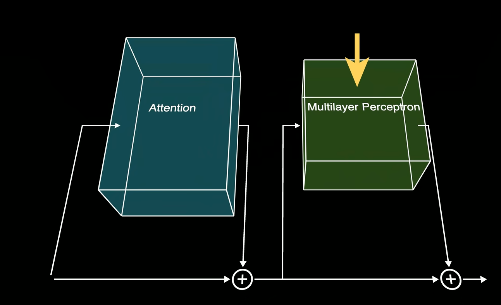

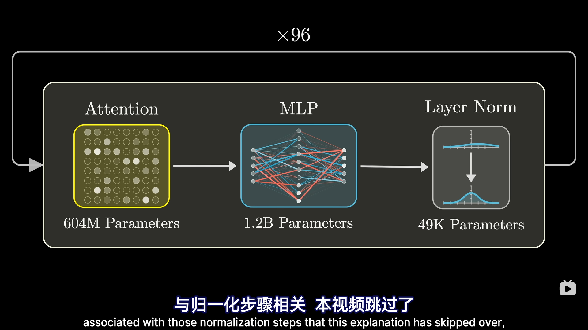

**Points:**

- 感知机阶段 向量不再相互交流，而是并行经历同一处理

  > 这个我很难理解，问问题不是相互交流，问题与其他 token 不相关？
  >
  > 答：
  >
  > 获取模型参数中蕴含的通用知识，现阶段不需要上下文的信息。

- 机器学习就是采用数据驱动，反馈到模型参数进而指导模型行为的方法

- 权重为模型大脑，随机初始化后训练后所学习得到，其决定了模型的行为模式

- transformer 的本意是什么？

  > 最初用于翻译 中文 <-> 英文

- 归一化就是 softmax？

  > softmax 是一种归一化方法，将输入映射到 0-1 之间的概率分布

- 向量的点积可以衡量他们的对其程度

**Source:**

- 初始嵌入向量包含的其他信息 Position

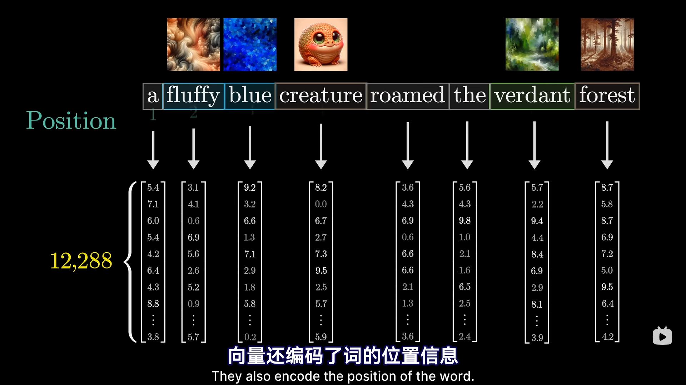

- GPT3 中[ Embedding martix ] 为 12288 * 50k

  > 表示一个 token 有 12288 个维度表示其语义
  >
  > 词汇库中具有 50k 个 token

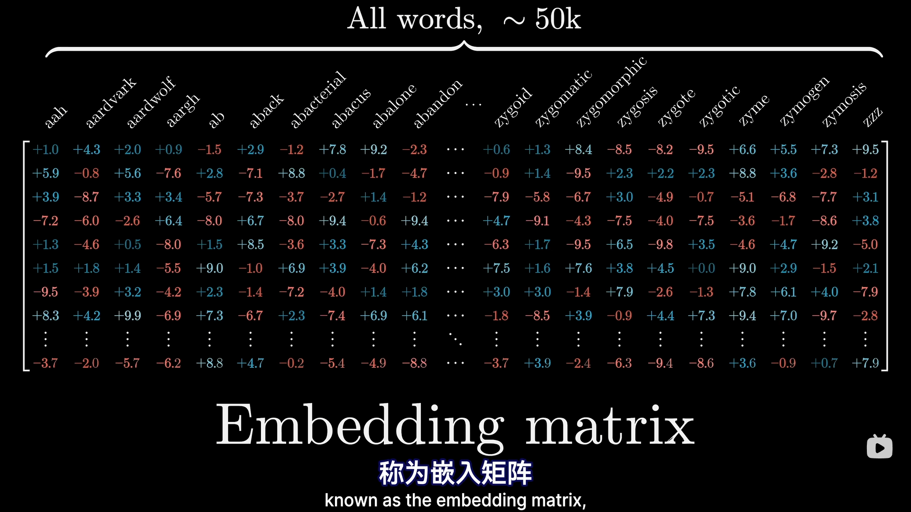

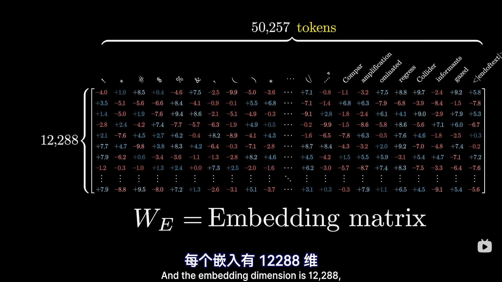

- 上下文限制

  > 网络一次能处理的嵌入向量的数量。
  >
  > 其限制了在预测下一个 token 时能结合的文本量。

-  [ Unembedding martix ] 

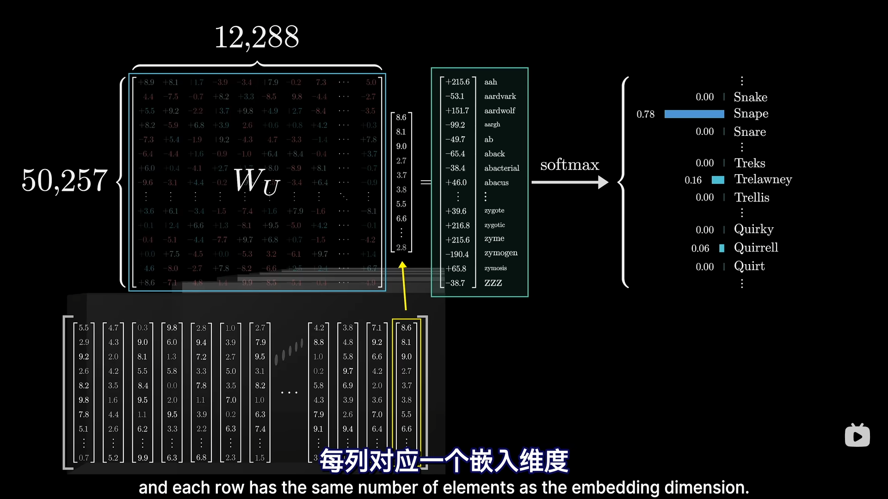

### 2 GPT Model Arguments / 参数量级

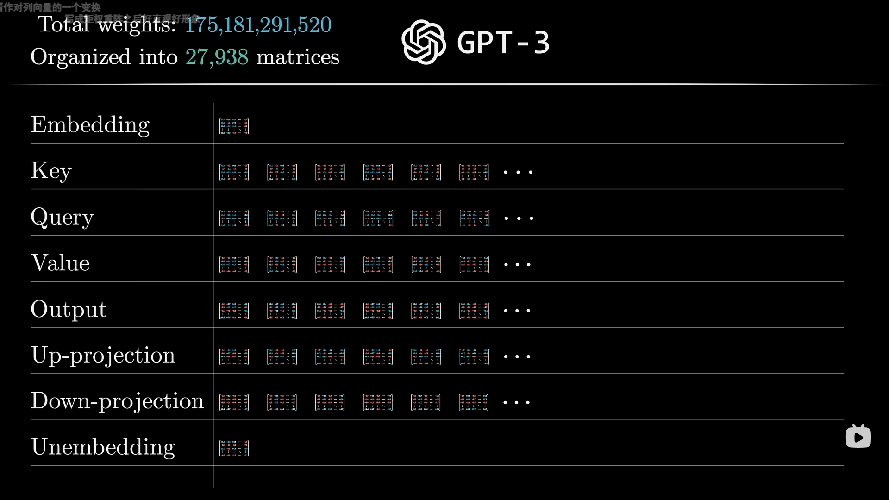

### Transformer 

>  Transformer 的目标是逐步调整嵌入向量，使其不单单包含单个词的含义，还能融入更丰富的上下文信息
>
>  `注意：`
>
>  1. 任何解释 transformer 在做什么的尝试，都几乎要回归到将信息编码仅高维嵌入向量的向量的想法。

- 若模型要准确预测输入后的下一个 token，那么输入上下文的最后一个嵌入向量，必须（经所有 transfomer 更新后），编码所有**上下文窗口**中与预测下一个 token 的有关的所有信息。

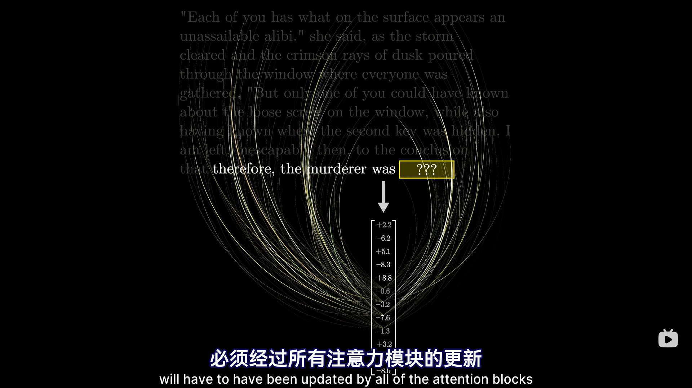

#### Single head of attention / 单头注意力机制

- Query / 查询向量 & Query matrix / 查询矩阵

  > 查询矩阵权重由数据习得，用于将嵌入向量映射到低维空间 [ Query-Key Space ]，得查询向量。
  >
  > 查询向量维度比嵌入向量小的多，如 128 - dimensional。
  >
  > 每个嵌入向量都将计算得出一个查询向量。

- Key / 键向量  Key matrix / 键矩阵

  > 键矩阵权重由数据习得，用于将嵌入向量映射到低维空间，得查询向量。
  >
  > 每个嵌入向量都将计算得出一个键向量，键向量。
  
- Attend to

  > 当键向量与查询向量方向相对齐时，则认为对应嵌入向量相匹配，**匹配程度 or 相关程度**由**点积结果** (负无穷 <-> 正无穷的任何实数) 衡量。

- Attention pattern / 注意力模式

  > 衡量所有键与所有查询的相关度，softmax 归一化后得对应相关系数权重，并以列为标准进行后续计算。
  >
  > 其规模与上下文长度的平方等同。

- Masking / 掩码   [可选]

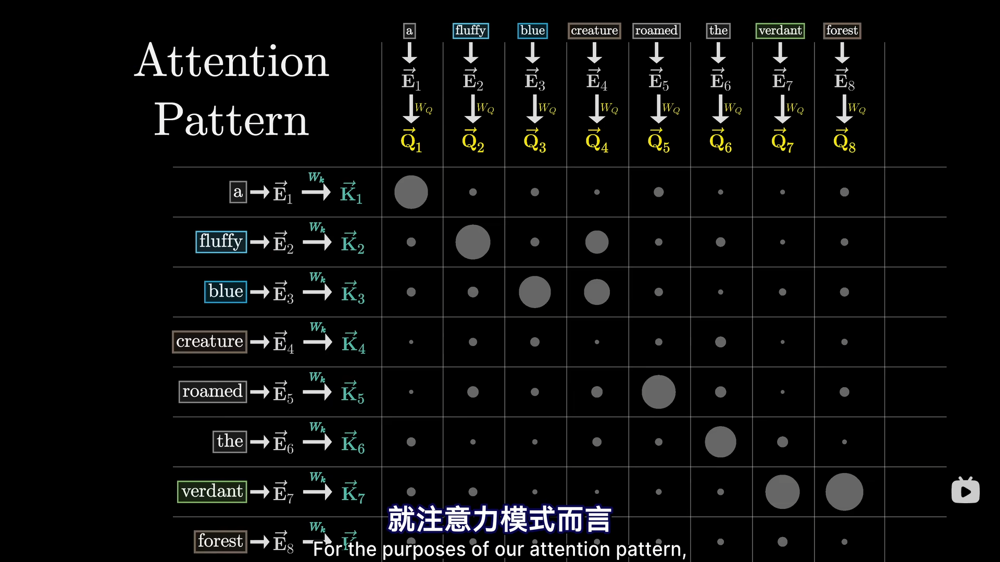

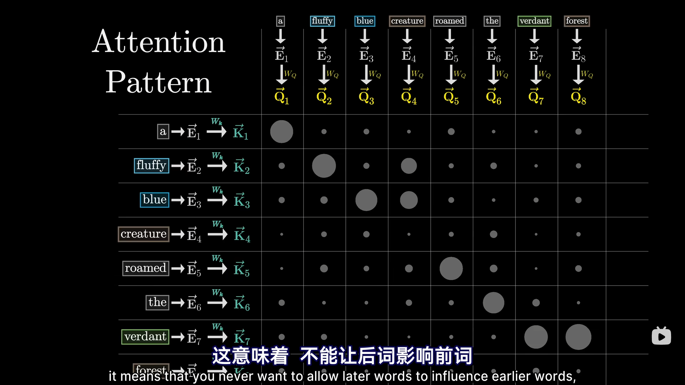

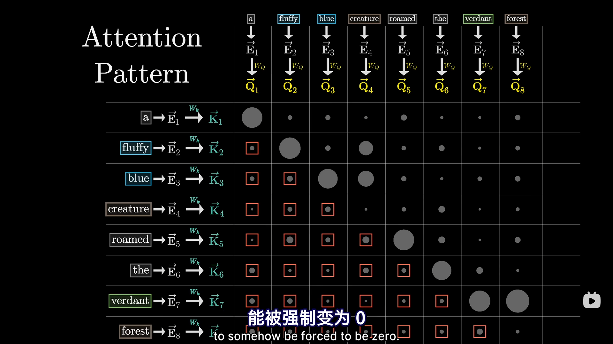

- Value Vector 值向量 & Value Matrix 值矩阵

  > 明确嵌入向量之间的相关性大小后，基于值矩阵对嵌入向量进行更新。
  >
  > 值矩阵将嵌入向量线性映射到同维空间，得到值向量△，该值向量×对应权重后作用到对应嵌入向量上。
  >
  > Attention pattern 中每一列均对所有带权值向量加和，即得到更新后的嵌入向量。
  >
  > 具体操作会将该线性映射**低秩分解**为两种映射，在多头注意力机制中尤为重要。

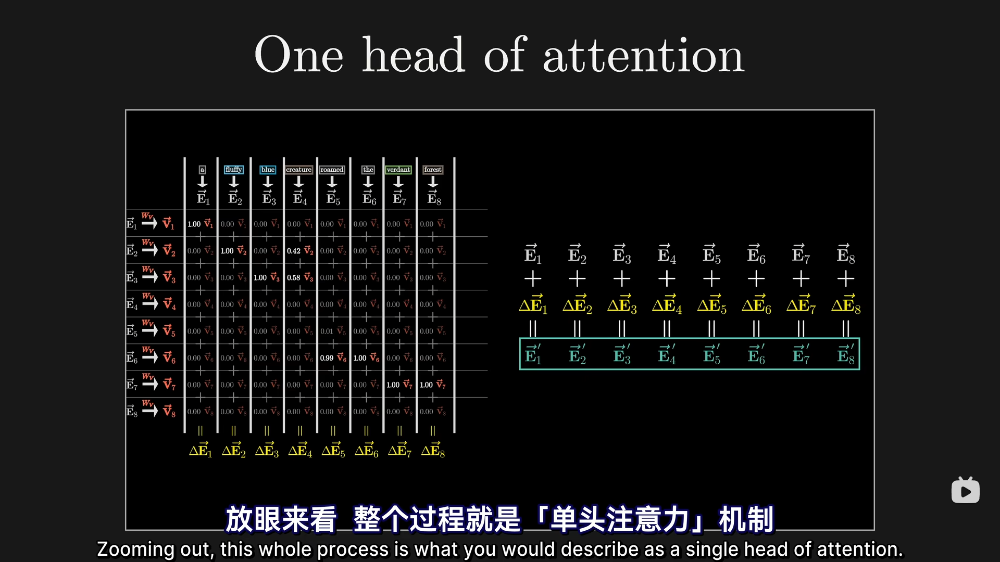

**Point:**

- 值矩阵维度为什么不单独用一个线性映射表示

  > 利于并行计算多个注意力头，使得值矩阵的参数量等同于查询矩阵与键矩阵之和。

#### Multi-headed attention / 多头注意力机制

> Transformer 中有多个注意力头，并行计算，不同的头拥有不同的查询，键值矩阵，用于聚焦不同角度的相关性。
>
> 最终用于更新嵌入向量的值向量将是所有注意力机制下的累积效果。

### Multilayer Perceptron / MLP 感知机模块

> **并行**为所有嵌入向量**附加**训练后模型权重中所蕴含的**通用知识**。
>
> `注意：`
>
> 1. 该阶段各个嵌入向量之间互不干扰。
> 2. MLP 为信息存储的位置。

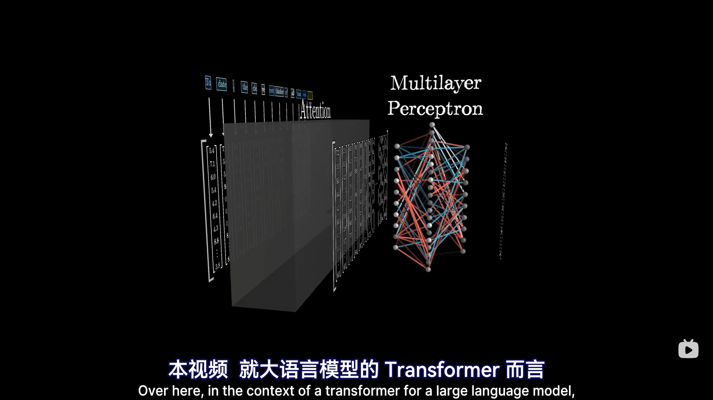

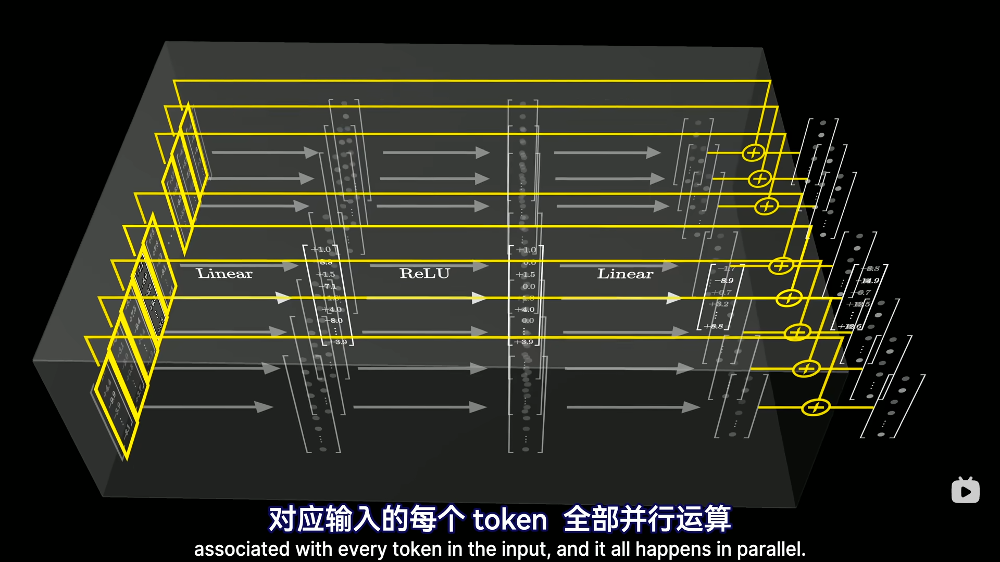

- [ Matrix A ]

  > 将嵌入向量映射到更高维的空间，简单理解每一行为几乎互相垂直的基向量。
  >
  > 每个嵌入向量都将与每个基向量(权重)作点积运算（矩阵总行数理解为被提问的数量），计算其与某个基的相关性或者说一致程度。

- ReLU / 线性整合单元

  > 正值不变 负值变零。
  >
  > 对步骤1中的输出作非线性激活，得神经元的值，值为正，说明神经元处理激活状态。

- [ The down projection matrix ] / [ 降维投影矩阵 ]

  > 将输出向量的维度降回到嵌入空间的维度。
  >
  > 哪些神经元被激活，最终结果将加入哪些信息。

- Superposition / 叠加

  > 得到待附加向量，最终附加到原始嵌入向量中去，附加通用知识。

  

  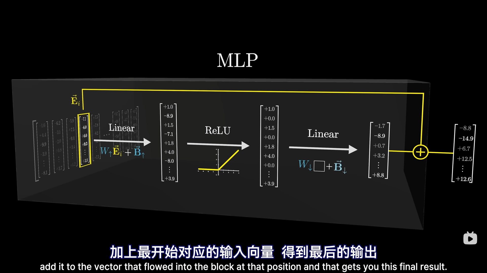

`注意：`

1. 单个神经元不会表征特征，而是要基于多个基向量的组会用于表征

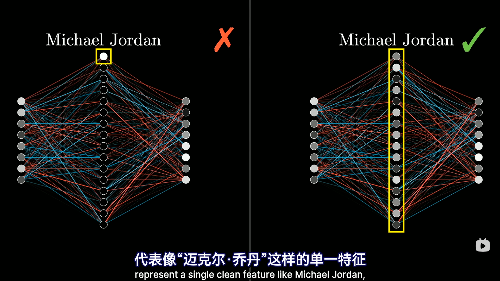

2. 为什么GPT模型规模随规模扩大而显著提升

   > 拥有更多的相互独立的概念，意味着拥有更多的基向量，就能够在有限的空间维数中表征更多的特征（存储更多的概念信息知识），这个规模不单单指嵌入空间规模，还带有 MLP 中隐藏层的规模。
   >
   > **约翰逊-林登斯特劳斯引理：**
   >
   > 能够塞进空间的几乎垂直的向量数量，随着维数增加指数增长。
   >
   > 意味着有着十倍维数的空间，能存储远超十倍的独立概念数

### 3 两种理解矩阵乘法的方法

- 多维空间到一维的投影集合

  > 矩阵每一行[向量]与向量的点积结果，构成结果向量的每一行元素。

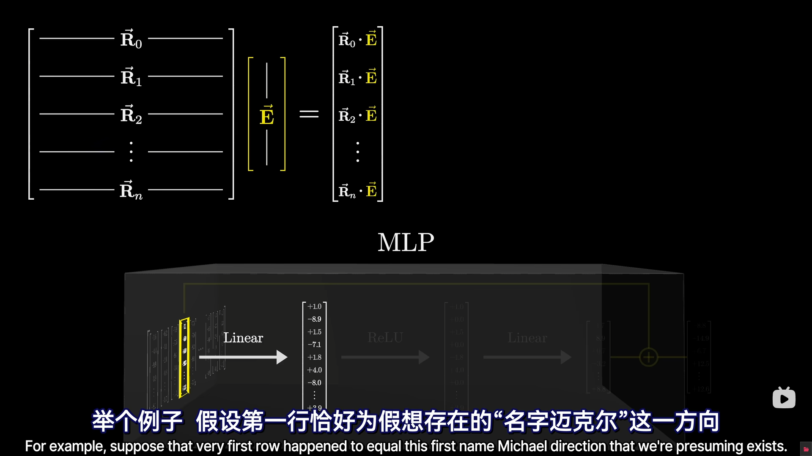

- 基向量张成空间的线性组合

  > 矩阵每一列[向量]乘以向量的对应项，将放缩后的列向量相加。

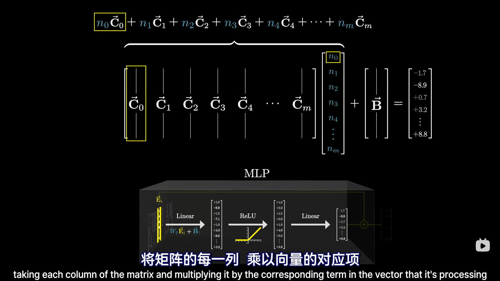

**Next：**

- 这里为什么是 Linear？

- 为什么查询与键矩阵，要映射到低维空间去找嵌入向量之间的相关性？

- 为什么模型规模随规模扩大而显著提升

  > 拥有更多的相互独立的概念，意味着拥有更多的基向量，就能够在有限的空间维数中表征更多的特征（存储更多的概念信息知识），这个规模不单单指嵌入空间规模，还带有 MLP 中隐藏层的规模。
  >
  > **？？？？？？？？？？？？**
  
- 解嵌入矩阵得 logitics 的步骤需要重新看一下，这个向量的维度是什么样的，为什么其中的向量元素可以作为 token 的概率密度分布？

  > 维度等同于嵌入矩阵的最大维度。

# MLP

- 什么是线性可分的数据？

  > 线性可分是指在一组数据点中，是否存在一条直线（二维情况下）、一个平面（三维情况下）或一个超平面（更高维情况下），能够将数据点完全分成两类，使得一类点都在分割面的某一边，另一类点都在另一边。

- 什么解决不了异或问题？

  > 单层感知机的局限性(单神经元，仅有输入输出层组成)。
  >
  > 异或问题的数据分布出现了非线性可分的模式，单纯一个线性决策边界（超平面）不足以区分这些模式。这个问题需要至少两个线性分类器(即隐藏层)才能解决,通过构造非线性决策边界来实现正确的分类。
  >
  > 多层感知机通过层与层之间的复合变换，来构建出能够表达非线性决策边界的复杂函数。

- 单层感知机

- 多层感知机

  > 添加隐藏层 N1,N2

- 

- 神经元数量与神经元层数与那个线性决策边界是什么关系？？？？？？

  > 单层感知机中，每个输出神经元决定一个决策边界，多个输出神经元创建多个独立的线性决策边界。
  >
  > 多层感知机中，上图为例，N1，N2分别决定一个线性决策边界，N3在对这两种决策边界作复杂组合，实现了从简单线性边界到复杂非线性决策边界的转换。
  >
  > 注意是后一层对前一层在做非线性复杂组合得到的非线性决策边界，上一层多个神经元形成的多个线性决策边界都是独立的。

- 单层感知机为什么和线性分离有关？

  > **单层感知器本质上是通过调整权重 w  和偏置 b 来找到一条分隔超平面**。如果数据是线性可分的，感知器可以通过学习规则调整参数，完美分类。但像XOR这样非线性可分的问题，单层感知器就无能为力了。这也是为什么后来发展出了多层感知器和反向传播——它们**可以用多个超平面组合出复杂的非线性边界**。

- 多层感知机权重如何训练?

  > 目前还不懂训练，决策边界问题懂了

- 人工调整权重的方法了之前那个L什么M的方法有什么异同？

  > 直接基于微积分算偏导？
  >
  > 直接调整权重？

